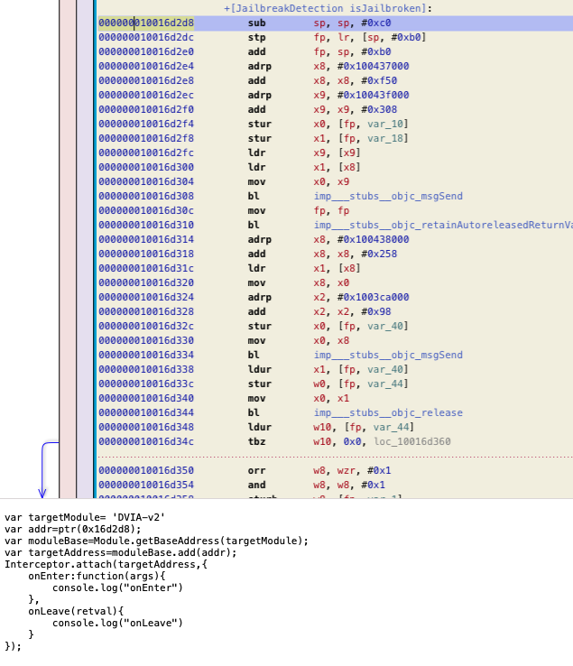

# FHopper
This script creates a Frida script by highlighting an address in hopper disassembler

## Installing
The scripts should be downloaded and placed in the 
**/Library/Application Support/Hopper/Scripts** folder

## Contributing
You can contribute to the project by opening a Pull request

## Future features
- Interact with Frida directly from the hopper
- Edit the Frida script 